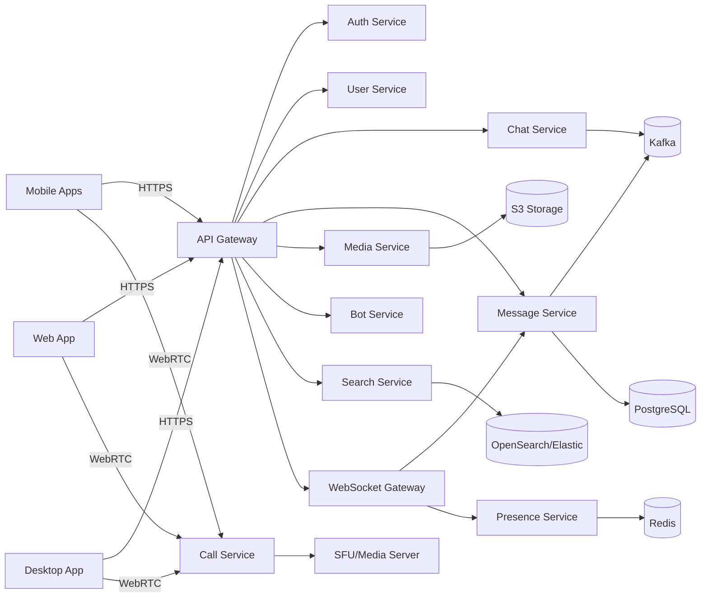

# Архитектура Dildogram

## 1. Общая схема (Mermaid)

## 2. Основные сервисы

| Сервис | Ответственность | Технологии |
|--------|----------------|------------|
| API Gateway | роутинг, auth middleware, rate limiting | Go + Envoy/Nginx |
| Auth Service | логин, сессии, 2FA | Go + Redis |
| User Service | профиль, контакты | Go + Postgres |
| Chat Service | чаты/каналы/роли | Go + Postgres |
| Message Service | сообщения, реакции | Go + Postgres + Kafka |
| Media Service | хранение файлов | Go + S3 |
| Call Service | звонки | Go + WebRTC/SFU |
| Bot Service | API ботов | Go + Webhooks |
| Search Service | поиск | Go + OpenSearch |
| Presence Service | онлайн/печатает | Go + Redis |

## 3. Потоки данных

### 3.1 Отправка сообщения
1. Клиент → API Gateway
2. Gateway → Message Service
3. Message Service → Postgres
4. Event `message.created` → Kafka
5. WebSocket Gateway → рассылает обновления

### 3.2 Синхронизация
- Клиент поднимает WebSocket
- Presence обновляется в Redis
- Сервер отправляет новые события

## 4. Масштабирование

- горизонтальное scaling всех stateless сервисов
- sticky sessions для WebSocket
- Media и Search — в отдельных кластерах
- Kafka и Redis в высокодоступном режиме

## 5. Best Practices

- Circuit breaker + retry policies
- Observability: Prometheus + Grafana
- Трассировка: OpenTelemetry
- Secure secrets: Vault / KMS
