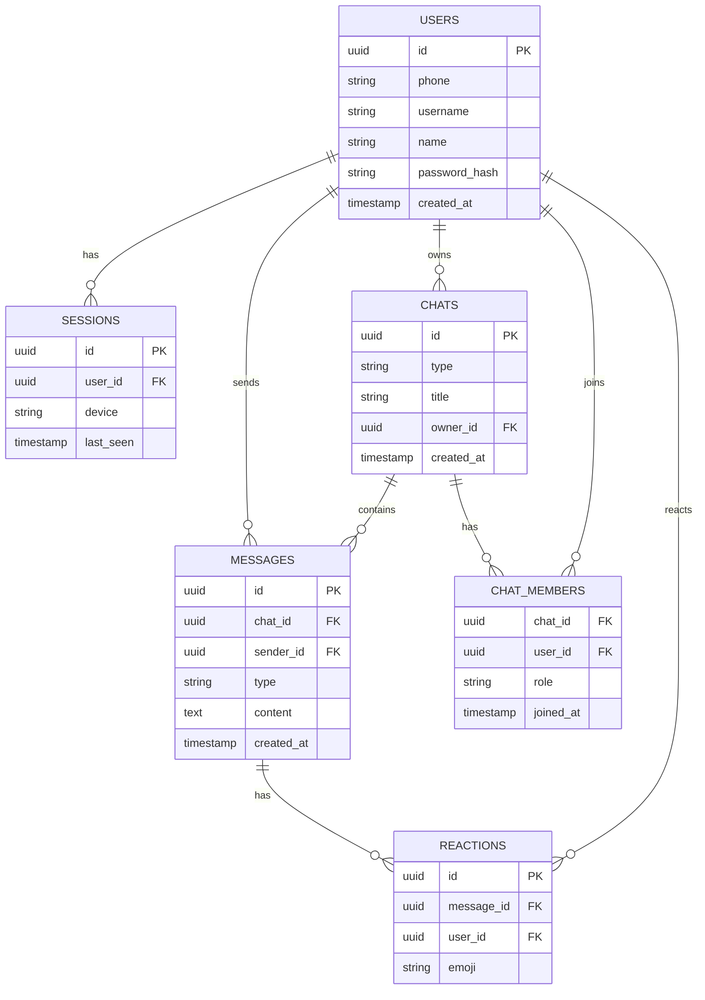

# База данных (ER-диаграмма и таблицы)

## ER (Mermaid)

## Основные таблицы

- **users** — учётные записи
- **sessions** — активные устройства
- **chats** — чаты/каналы
- **chat_members** — участники
- **messages** — сообщения
- **reactions** — реакции

## Индексы

- `messages (chat_id, created_at)`
- `chat_members (chat_id, user_id)`
- `users (phone, username)`
